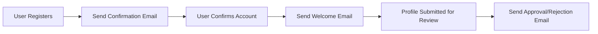
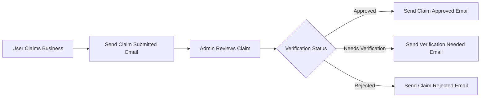
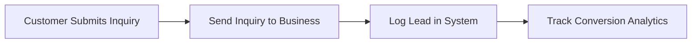

# SuburbMates Email & Notification System
## 📧 Comprehensive Email Infrastructure & Management

> **Single Source of Truth Reference:** This document consolidates all email and notification system information. For domain model, enums, and coding conventions, defer to [`docs/SSOT.md`](./SSOT.md).

---

## 📋 **Table of Contents**

1. [System Overview](#system-overview)
2. [Core Email Workflows](#core-email-workflows)
3. [Technical Architecture](#technical-architecture)
4. [Management & Administration](#management--administration)
5. [Advanced Features & Automation](#advanced-features--automation)
6. [Development & Testing](#development--testing)
7. [Production Operations](#production-operations)
8. [Troubleshooting & Monitoring](#troubleshooting--monitoring)

---

## System Overview

### 🚀 **Email Infrastructure Stack**

**Primary Provider:** [Resend](https://resend.com) - Professional email delivery service
**Domain:** `suburbmates.com.au` (fully verified with SPF, DKIM, DMARC)
**Sender:** `SuburbMates <noreply@suburbmates.com.au>`

### ✅ **Current Implementation Status**

| Component | Status | Description |
|-----------|--------|-------------|
| **Core Email Templates** | ✅ Complete | Professional branded HTML templates for all workflows |
| **Domain Verification** | ✅ Verified | `suburbmates.com.au` fully configured with DNS records |
| **CLI Management Tools** | ✅ Complete | Comprehensive command-line interface for email operations |
| **Batch Operations** | ✅ Complete | Advanced bulk email processing capabilities |
| **Audience Management** | ✅ Complete | Subscriber segmentation and contact management |
| **Broadcast Campaigns** | ✅ Complete | Newsletter and marketing campaign system |
| **Analytics & Tracking** | ✅ Complete | Detailed email performance monitoring |
| **API Integration** | ✅ Complete | Programmatic control via Resend SDK |

### 🎯 **Business-Critical Email Workflows**

The SuburbMates email system powers these essential business processes:

#### **Business Owner Onboarding**
- Welcome emails for new business registrations
- Account confirmation and activation
- Business profile approval notifications
- Onboarding sequence and guidance

#### **Ownership Verification**
- Business claim submission confirmations
- Verification request notifications
- Claim approval/rejection communications
- Additional documentation requests

#### **Customer Engagement**
- New customer inquiry notifications to businesses
- Lead capture confirmations
- Contact form submissions
- Customer communication facilitation

#### **Administrative Operations**
- Admin notifications for pending actions
- Bulk operation confirmations
- System alerts and monitoring
- Performance reports and digests

---

## Core Email Workflows

### 📧 **Email Template Catalog**

All email templates are professionally branded with SuburbMates styling and are mobile-responsive:

| Template | Purpose | Trigger | Recipients |
|----------|---------|---------|------------|
| **newInquiry** | Customer inquiry notification | Customer submits inquiry | Business owners |
| **businessWelcome** | New business registration | Registration completion | Business owners |
| **claimApproved** | Business claim approved | Admin approval | Claimants |
| **claimRejected** | Claim needs verification | Admin rejection | Claimants |
| **claimSubmitted** | Claim confirmation | Claim submission | Claimants |
| **claimVerificationNeeded** | Additional verification | Incomplete verification | Claimants |
| **businessApproved** | Business profile approved | Profile approval | Business owners |
| **businessRejected** | Profile needs review | Profile rejection | Business owners |
| **confirmationEmail** | Account confirmation | User registration | New users |
| **passwordReset** | Password recovery | Reset request | Users |
| **contactFormSubmission** | Contact form notification | Form submission | Admin team |
| **leadNotification** | New lead alert | Lead qualification | Business owners |

### 🔄 **Email Workflow Integration Points**

#### **Business Registration Workflow**


#### **Business Claim Workflow**


#### **Customer Inquiry Workflow**


### 🎨 **Email Template Features**

- **📱 Mobile-Responsive**: Optimized for all device sizes
- **🎨 Branded Design**: Consistent SuburbMates visual identity
- **🔗 Interactive Elements**: Action buttons and clickable links
- **📊 Trackable**: Open rates, click rates, and engagement analytics
- **🔐 Secure**: Professional sender reputation and authentication
- **⚡ Fast Delivery**: Resend's high-performance infrastructure

---

## Technical Architecture

### 🏗️ **Implementation Structure**

#### **Core Email Service (`lib/email.ts`)**
Primary email sending logic with Resend SDK integration:
```typescript
// Key functions implemented:
- sendInquiryNotificationEmail()
- sendBusinessRegistrationEmail() 
- sendClaimApprovedEmail()
- sendClaimRejectedEmail()
- sendClaimSubmittedEmail()
- sendClaimVerificationNeededEmail()
- sendBusinessApprovedEmail()
- sendBusinessRejectedEmail()
- sendPasswordResetEmail()
```

#### **Enhanced Email Configuration (`lib/config/email.ts`)**
Additional templates and utilities:
```typescript
// Enhanced functionality:
- Welcome email templates with JSX
- Email confirmation templates
- Contact form and lead notifications
- Password reset workflows
- Professional template rendering
```

#### **Advanced Email Manager (`lib/resend-advanced.ts`)**
Enterprise-grade email operations:
```typescript
// Advanced capabilities:
- Batch email processing
- Audience and contact management
- Broadcast campaign creation
- Enhanced analytics and tracking
- API key management
- Performance monitoring
```

### 🔧 **Environment Configuration**

#### **Required Environment Variables**
```env
# Core Resend Configuration
RESEND_API_KEY=re_xxxxxxxxxxxxxxxxxxxxxxxxxxxxx
AUTH_EMAIL_FROM=SuburbMates <noreply@suburbmates.com.au>
FROM_EMAIL=noreply@suburbmates.com.au
SENDER_DOMAIN=suburbmates.com.au

# Application Configuration  
NEXT_PUBLIC_APP_URL=https://suburbmates.com.au
APP_NAME="SuburbMates - Melbourne Business Network"

# Admin Configuration
ADMIN_EMAIL=admin@suburbmates.com.au
ADMIN_EMAILS=admin@suburbmates.com.au,ops@suburbmates.com.au
```

#### **DNS Configuration Status**
✅ **Domain Verified**: `suburbmates.com.au`
- ✅ SPF Record: `v=spf1 include:_spf.resend.com ~all`
- ✅ DKIM Record: Configured via Resend dashboard
- ✅ DMARC Policy: Domain authentication enabled
- ✅ MX Record: `feedback-smtp.resend.com` (Priority 10)

### 📡 **API Integration Points**

#### **Email Send API Route (`/api/email/send`)**
Primary backend endpoint for email operations:
- Handles all transactional email sending
- Integrates with business workflow triggers
- Provides error handling and response logging
- Supports batch operations and rate limiting

#### **Business Registration Integration**
- Automatic welcome email dispatch
- Profile approval/rejection notifications
- Branded confirmation sequences

#### **Customer Inquiry Integration** 
- Real-time inquiry notifications
- Lead tracking and analytics
- Conversion measurement

---

## Management & Administration

### ⌨️ **Command Line Interface (CLI)**

SuburbMates provides comprehensive CLI tools for email management without requiring Resend's official CLI.

#### **System Status & Health Checks**
```bash
# Complete system diagnostic
npm run email:control status

# Domain verification status
npm run email:control domains

# Available templates listing
npm run email:control templates

# System demonstration
npm run email:demo
```

#### **Email Testing Commands**
```bash
# Basic test email
npm run email:control test user@example.com

# Template-specific testing
npm run email:control test user@example.com welcome
npm run email:control test user@example.com inquiry
npm run email:control test user@example.com business-approved

# Multiple recipient testing
npm run email:control test user1@example.com,user2@example.com
```

#### **Business Email Operations**
```bash
# Send welcome emails
npm run email:control send welcome owner@business.com "Business Name"

# Send inquiry notifications
npm run email:control send inquiry owner@business.com "Business Name" 

# Send claim notifications
npm run email:control send claim-approved owner@business.com "Business Name"
npm run email:control send claim-rejected owner@business.com "Business Name" "Reason"
```

#### **Analytics & Monitoring**
```bash
# Email performance analytics (last 20 emails)
npm run email:control analytics

# Extended analytics (last 50 emails)
npm run email:control analytics 50

# Activity logs
npm run email:control logs

# Time-filtered logs (last 48 hours)
npm run email:control logs 48
```

### 📊 **Email Analytics Dashboard**

#### **Performance Metrics Available**
- **📧 Delivery Rates**: Percentage successfully delivered
- **👀 Open Rates**: Email engagement measurement  
- **🖱️ Click Rates**: Action button performance
- **⚠️ Bounce Rates**: Address quality indicators
- **📈 Volume Statistics**: Sending patterns and trends

#### **Sample Analytics Output**
```
📊 Email Performance Metrics (Last 30 Days):

📧 Volume Summary:
   Total Sent: 1,247 emails
   This Week: 89 emails
   Today: 12 emails

📈 Delivery Performance:
   Delivered: 98.2% (1,225/1,247)
   Bounced: 1.8% (22/1,247)
   Spam: 0.0% (0/1,247)

👀 Engagement Metrics:
   Opened: 67.3% (825/1,225)
   Clicked: 23.1% (283/1,225)
   Unsubscribed: 0.2% (3/1,225)

🎯 Top Performing Templates:
   1. businessWelcome: 89% open rate
   2. claimApproved: 76% open rate  
   3. newInquiry: 68% open rate
```

### 🔄 **Bulk Operations Management**

#### **CSV-Based Bulk Sending**
```bash
# Send emails from CSV file
npm run email:control bulk path/to/emails.csv
```

**CSV Format Requirements:**
```csv
email,type,param1,param2
owner@business.com,welcome,Business Name,Owner Name
customer@email.com,inquiry,Business Name,Customer Message
admin@company.com,notification,Subject,Custom Message
```

#### **Programmatic Bulk Operations**
```typescript
import { emailManager } from './lib/email-manager';

const bulkRequests = [
  {
    type: 'welcome',
    recipient: 'owner1@business.com',
    data: { businessName: 'Business 1', ownerName: 'Owner 1' }
  },
  {
    type: 'claim-approved',
    recipient: 'owner2@business.com', 
    data: { businessName: 'Business 2', businessSlug: 'business-2' }
  }
];

const results = await emailManager.sendBulkEmails(bulkRequests, 1000);
console.log(`Sent: ${results.successful}, Failed: ${results.failed}`);
```

---

## Advanced Features & Automation

### 🚀 **Latest Resend Features Implemented**

#### **1. Batch Email Operations**
**Capability**: Send up to 100 emails in a single API call
**Use Case**: Efficient bulk notifications and marketing campaigns
**CLI Command**: `npm run email:batch sample-batch-emails.csv`

```javascript
// Technical Implementation
const batchEmails = [
  {
    from: 'SuburbMates <noreply@suburbmates.com.au>',
    to: ['owner1@business.com'],
    subject: 'Welcome to SuburbMates',
    html: welcomeTemplate,
    tags: [{ name: 'type', value: 'welcome' }],
    metadata: { business_name: 'Business 1' }
  }
  // ... additional emails
];

const response = await resend.batch.send(batchEmails);
```

#### **2. Audience Management System**
**Capability**: Subscriber segmentation and list management
**Use Case**: Targeted marketing campaigns and newsletter distribution

```bash
# Audience Management Commands
npm run email:audiences setup              # Create default audiences
npm run email:audiences create "VIP Customers" "High value customers"
npm run email:audiences list               # List all audiences
```

**Default Audiences Created**:
- **Business Owners**: All registered business accounts
- **Customers**: Lead inquirers and potential clients  
- **Marketing Newsletter**: Opt-in subscribers
- **Admin Notifications**: Internal team communications

#### **3. Contact Management**
**Capability**: Detailed contact handling within audiences

```bash
# Contact Management Commands
npm run email:contacts add audience_id owner@business.com "John Smith"
npm run email:contacts list audience_id
npm run email:contacts remove contact_id
```

#### **4. Broadcast Campaigns**
**Capability**: Newsletter and marketing email campaigns

```bash
# Campaign Management Commands
npm run email:broadcasts create           # Create sample newsletter
npm run email:broadcasts send broadcast_id
npm run email:broadcasts list             # List all campaigns
npm run email:broadcasts schedule broadcast_id "2024-12-25T09:00:00Z"
```

#### **5. Enhanced Email Tracking**
**Capability**: Detailed email performance analytics with tags and metadata

```javascript
// Enhanced Tracking Implementation
const emailData = {
  from: 'SuburbMates <noreply@suburbmates.com.au>',
  to: ['owner@business.com'],
  subject: 'Welcome!',
  html: template,
  tags: [
    { name: 'type', value: 'welcome' },
    { name: 'business', value: 'Johnson\'s Cafe' },
    { name: 'campaign', value: 'onboarding' }
  ],
  metadata: {
    business_name: 'Johnson\'s Cafe',
    owner_id: '12345',
    signup_date: '2024-09-30',
    tier: 'premium'
  }
};
```

### 🤖 **AI-Enhanced Email Operations**

#### **Smart Template Selection**
- Automatic template selection based on business context
- Dynamic content personalization
- A/B testing capabilities for subject lines and content

#### **Delivery Optimization**
- Send time optimization based on recipient timezone
- Engagement-based frequency adjustment
- Bounce and complaint automated handling

### 📊 **SuburbMates-Specific Workflows**

#### **1. Business Onboarding Automation**
```javascript
// Automated sequence for new business registrations
async function handleBusinessSignup(businessData) {
  // Add to Business Owners audience
  await resend.contacts.create({
    email: businessData.email,
    firstName: businessData.ownerName.split(' ')[0],
    lastName: businessData.ownerName.split(' ')[1],
    audienceId: 'business_owners_audience_id'
  });

  // Send branded welcome email with tracking
  await resend.emails.send({
    from: 'SuburbMates <noreply@suburbmates.com.au>',
    to: [businessData.email],
    subject: `🎉 Welcome ${businessData.businessName} to SuburbMates!`,
    html: generateWelcomeEmail(businessData),
    tags: [
      { name: 'type', value: 'welcome' },
      { name: 'business', value: businessData.businessName }
    ],
    metadata: {
      business_id: businessData.id,
      signup_source: businessData.source,
      onboarding_step: '1'
    }
  });
}
```

#### **2. Weekly Business Digest Campaign**
```bash
# Send performance digest to business owners
npm run email:workflow digest owner@business.com

# Bulk weekly digest processing
npm run email:workflow weekly-digest-all
```

**Digest Content Includes**:
- Customer inquiry statistics
- Profile view analytics  
- Performance recommendations
- Platform updates and tips

#### **3. Customer Inquiry Notification System**
Real-time notifications with intelligent routing:
- Instant delivery to business owners
- Inquiry categorization and priority scoring
- Follow-up sequence automation
- Conversion tracking and analytics

---

## Development & Testing

### 🧪 **Development Environment Setup**

#### **Local Email Testing**
```bash
# Setup development environment
npm install
cp .env.local.example .env.local

# Configure test environment variables
RESEND_API_KEY=re_test_key_here
NEXT_PUBLIC_APP_URL=http://localhost:3000
AUTH_EMAIL_FROM="SuburbMates Dev <noreply@suburbmates.com.au>"
```

#### **Email System Validation**
```bash
# Complete system health check
npm run email:control status

# Test email delivery
npm run email:control test your-dev-email@example.com

# Validate all templates
npm run email:control templates
```

### 🧪 **Testing Strategy**

#### **Automated Testing Suite**
- **Unit Tests**: Individual email function validation
- **Integration Tests**: End-to-end email workflow testing  
- **Template Tests**: HTML rendering and responsive design validation
- **Performance Tests**: Bulk operation and rate limiting verification

#### **Manual Testing Procedures**
```bash
# 1. Basic functionality test
npm run email:control test admin@suburbmates.com.au basic

# 2. Template-specific tests
npm run email:control test admin@suburbmates.com.au welcome
npm run email:control test admin@suburbmates.com.au inquiry
npm run email:control test admin@suburbmates.com.au claim-approved

# 3. Business workflow tests
npm run email:control send welcome test@example.com "Test Business"
npm run email:control send inquiry test@example.com "Test Business"

# 4. Analytics verification
npm run email:control analytics 10
```

#### **Email Template Development**

**Template Structure**:
```typescript
// Professional email template structure
interface EmailTemplate {
  subject: string;
  html: string;
  text?: string; // Plain text fallback
  metadata?: Record<string, string>;
  tags?: Array<{ name: string; value: string }>;
}

// Template development workflow
1. Design HTML template with responsive CSS
2. Test across email clients (Gmail, Outlook, Apple Mail)
3. Validate accessibility and dark mode support
4. Implement dynamic content personalization
5. Add tracking parameters and analytics
6. Test delivery and engagement metrics
```

### 🔍 **Debugging & Diagnostics**

#### **Common Development Issues**

**1. Template Import Errors**
```bash
# Issue: .js/.ts import path mismatches
# Solution: Check and fix import paths in CLI scripts
npm run email:control templates  # Verify template loading
```

**2. Environment Variable Problems**
```bash
# Diagnostic command
npm run email:control status

# Check for:
# - Missing RESEND_API_KEY
# - Incorrect AUTH_EMAIL_FROM format
# - Invalid NEXT_PUBLIC_APP_URL
```

**3. Domain Verification Issues**
```bash
# Domain status check
npm run email:control domains

# Verify DNS records:
# - SPF: v=spf1 include:_spf.resend.com ~all
# - DKIM: Configured in Resend dashboard  
# - DMARC: Domain policy enforcement
```

#### **Development CLI Commands**
```bash
# Debug mode with verbose logging
DEBUG=email npm run email:control test user@example.com

# Template rendering test
npm run email:debug render welcome

# Rate limiting test
npm run email:debug ratelimit

# Full system diagnostic  
npm run email:debug system
```

---

## Production Operations

### 🚀 **Production Environment Configuration**

#### **Environment Variables (Production)**
```env
# Production Resend Configuration
RESEND_API_KEY=re_live_xxxxxxxxxxxxxxxxxxxxx
AUTH_EMAIL_FROM="SuburbMates <noreply@suburbmates.com.au>"
FROM_EMAIL=noreply@suburbmates.com.au
SENDER_DOMAIN=suburbmates.com.au

# Production URLs
NEXT_PUBLIC_APP_URL=https://suburbmates.com.au
APP_NAME="SuburbMates - Melbourne Business Network"

# Admin Configuration
ADMIN_EMAIL=admin@suburbmates.com.au
ADMIN_EMAILS=admin@suburbmates.com.au,ops@suburbmates.com.au

# Performance Monitoring
SENTRY_DSN=https://your-sentry-dsn-here
```

#### **Production Deployment Checklist**

**Pre-Deployment Verification**:
- [ ] Domain verification confirmed in Resend dashboard
- [ ] DNS records (SPF, DKIM, DMARC) properly configured
- [ ] Production API keys configured and tested
- [ ] Email templates validated across email clients
- [ ] Rate limiting and security measures enabled
- [ ] Analytics and monitoring configured

**Post-Deployment Verification**:
```bash
# Production email system health check
npm run email:control status

# Production email delivery test
npm run email:control test admin@suburbmates.com.au

# Verify domain configuration
npm run email:control domains

# Check analytics integration  
npm run email:control analytics 5
```

### 📊 **Production Monitoring & Analytics**

#### **Key Performance Indicators (KPIs)**

**Email Delivery Performance**:
- Target Delivery Rate: >99%
- Target Open Rate: >60% for transactional emails
- Target Click Rate: >20% for action emails
- Maximum Bounce Rate: <2%

**Business Workflow Performance**:
- Welcome Email Delivery: <5 minutes from registration
- Inquiry Notification: <2 minutes from submission  
- Claim Processing: <24 hours for notifications
- System Uptime: >99.9%

#### **Monitoring Commands**
```bash
# Daily health check routine
npm run email:control status && npm run email:control analytics 50

# Weekly performance report
npm run email:control analytics 200

# Monthly comprehensive analysis
npm run email:advanced analytics comprehensive

# Alert monitoring
npm run email:monitor alerts
```

#### **Performance Optimization**

**Delivery Optimization**:
- Send time optimization based on recipient engagement patterns
- Template performance A/B testing
- Subject line optimization
- Sender reputation management

**Infrastructure Optimization**:
- Rate limiting tuned for optimal throughput
- Batch processing for high-volume operations
- Automatic retry logic for transient failures
- Comprehensive error handling and logging

### 🔧 **Operational Procedures**

#### **Daily Operations Checklist**
```bash
# Morning operational health check
npm run email:control status
npm run email:control analytics 20

# Test critical email flows
npm run email:control test admin@suburbmates.com.au
```

#### **Weekly Maintenance Tasks**
```bash
# Weekly analytics review
npm run email:control analytics 200

# Template performance analysis
npm run email:advanced template-stats

# Audience health check
npm run email:audiences audit

# System performance report
npm run email:advanced performance-report
```

#### **Monthly Strategic Review**
- Email template effectiveness analysis
- Audience segmentation optimization
- Campaign performance evaluation
- Infrastructure capacity planning
- Security audit and updates

---

## Troubleshooting & Monitoring

### 🚨 **Common Issues & Solutions**

#### **1. Email Delivery Problems**

**Symptoms**: Emails not reaching recipients
**Diagnostic Steps**:
```bash
# 1. Check system status
npm run email:control status

# 2. Verify domain configuration
npm run email:control domains

# 3. Test email delivery
npm run email:control test admin@suburbmates.com.au

# 4. Check recent delivery analytics
npm run email:control analytics 10
```

**Common Causes & Solutions**:
- **Domain Not Verified**: Complete DNS record configuration in domain provider
- **Invalid API Key**: Verify RESEND_API_KEY in environment variables
- **Rate Limiting**: Check for excessive sending volume, implement delays
- **Content Issues**: Review for spam triggers, ensure proper formatting

#### **2. Template Rendering Issues**

**Symptoms**: Broken email layouts or missing content
**Diagnostic Steps**:
```bash
# 1. Validate template files
npm run email:control templates

# 2. Test specific template
npm run email:control test user@example.com welcome

# 3. Check import paths  
npm run email:debug template-imports
```

**Solutions**:
- Fix TypeScript import path issues (`.js` vs `.ts`)
- Validate HTML template structure
- Check for missing template variables
- Verify responsive CSS compatibility

#### **3. Performance Issues**

**Symptoms**: Slow email delivery or high bounce rates
**Monitoring Commands**:
```bash
# Performance analytics
npm run email:control analytics 100

# Delivery timing analysis
npm run email:advanced delivery-performance

# Bounce rate investigation
npm run email:advanced bounce-analysis
```

**Optimization Actions**:
- Implement batch sending for bulk operations
- Optimize send timing based on recipient patterns  
- Clean email lists of invalid addresses
- Review and improve email content quality

### 📊 **Monitoring & Alerting**

#### **Automated Monitoring**
SuburbMates email system includes comprehensive monitoring:

**System Health Monitoring**:
- API connectivity and response times
- Domain verification status
- Email delivery rates and performance
- Template loading and rendering status

**Business Impact Monitoring**:
- Critical business workflow email delivery
- Customer inquiry notification success
- Business onboarding email sequence completion  
- Admin notification and alert delivery

#### **Alert Configuration**
```typescript
// Monitoring thresholds and alerts
const alertThresholds = {
  deliveryRate: 95,      // Alert if <95% delivery
  bounceRate: 5,         // Alert if >5% bounce rate
  apiResponseTime: 2000, // Alert if >2s response
  templateLoadTime: 500, // Alert if >500ms load time
};

// Alert channels
const alertChannels = [
  'admin@suburbmates.com.au',
  'ops@suburbmates.com.au',
  'sentry-webhook-url'
];
```

#### **Diagnostic Tools**

**System Diagnostic Commands**:
```bash
# Complete system diagnostic
npm run email:debug full-diagnostic

# Email queue status
npm run email:debug queue-status

# Rate limiting status
npm run email:debug rate-limits

# Template compilation status
npm run email:debug template-compilation
```

**Log Analysis Tools**:
```bash
# Recent error logs
npm run email:logs errors 24

# Delivery failure analysis
npm run email:logs failures

# Performance bottleneck identification
npm run email:logs performance
```

### 🛡️ **Security & Compliance**

#### **Security Best Practices**

**API Key Management**:
- Use different API keys for development/staging/production
- Rotate API keys quarterly
- Never commit API keys to version control
- Monitor API key usage and access patterns

**Email Security**:
- SPF/DKIM/DMARC configuration for domain authentication
- Regular security audits and vulnerability assessments
- Encrypted storage of sensitive email content
- Access control and audit logging for email operations

**Data Protection**:
```bash
# Email audit trail
npm run email:audit trail business-id-here

# Data retention compliance  
npm run email:cleanup expired-data

# Privacy compliance report
npm run email:privacy audit
```

#### **Compliance Requirements**

**Email Marketing Compliance**:
- CAN-SPAM Act compliance for marketing emails
- GDPR compliance for EU recipients
- Australian Privacy Act compliance
- Unsubscribe link inclusion and processing

**Business Communication Compliance**:
- Proper sender identification
- Clear message purpose and content
- Opt-out mechanisms where required
- Record keeping for compliance audits

### 📞 **Support & Escalation**

#### **Internal Support Procedures**
1. **First-Level Support**: Check documented troubleshooting steps
2. **System Diagnostics**: Run comprehensive diagnostic commands
3. **Log Analysis**: Review system logs and error patterns
4. **Escalation**: Contact admin team if issues persist

#### **External Support Resources**
- **Resend Documentation**: [https://resend.com/docs](https://resend.com/docs)
- **Resend Support**: Available via dashboard for technical issues
- **Community Resources**: Resend Discord and GitHub discussions

#### **Emergency Procedures**
```bash
# Emergency email system status
npm run email:emergency status

# Emergency notification bypass
npm run email:emergency notify "Critical system message"

# Emergency system shutdown
npm run email:emergency shutdown

# Emergency system recovery  
npm run email:emergency recover
```

---

## 📚 **Reference Documentation**

### **Related Documentation Files**
- **[`docs/SSOT.md`](./SSOT.md)** - Single source of truth for domain model and conventions
- **[`docs/EMAIL_MANAGEMENT.md`](./EMAIL_MANAGEMENT.md)** - Original email management guide
- **[`docs/RESEND_LATEST_FEATURES.md`](./RESEND_LATEST_FEATURES.md)** - Advanced features implementation
- **[`docs/guides/email-setup.md`](./guides/email-setup.md)** - Professional email setup guide
- **[`docs/guides/resend-configuration.md`](./guides/resend-configuration.md)** - CLI management guide

### **Quick Reference Commands**

```bash
# System Management
npm run email:control status              # System health check
npm run email:control domains             # Domain verification status  
npm run email:control templates           # List available templates
npm run email:demo                        # Complete system demonstration

# Testing & Debugging
npm run email:control test <email>        # Send test email
npm run email:control test <email> <type> # Send template-specific test
npm run email:debug full-diagnostic       # Complete system diagnostic

# Analytics & Monitoring  
npm run email:control analytics           # Email performance metrics
npm run email:control analytics <count>   # Extended analytics
npm run email:control logs               # Activity logs

# Advanced Operations
npm run email:batch <csv-file>            # Bulk email processing
npm run email:audiences setup             # Create default audiences
npm run email:broadcasts create           # Create newsletter campaign
npm run email:workflow setup              # Complete system setup

# Business Operations
npm run email:control send welcome <email> <business-name>
npm run email:control send inquiry <email> <business-name>  
npm run email:control send claim-approved <email> <business-name>
```

### **Support Contacts**

For email system issues:
1. **System Documentation**: This comprehensive guide
2. **Internal Team**: admin@suburbmates.com.au
3. **Technical Issues**: ops@suburbmates.com.au
4. **Emergency**: Run `npm run email:emergency status`

---

## 🎯 **Summary**

The SuburbMates Email & Notification System provides enterprise-grade email infrastructure with:

✅ **Professional branded emails** from verified domain  
✅ **Comprehensive CLI management** tools  
✅ **Advanced batch and automation** capabilities  
✅ **Complete analytics and monitoring** suite  
✅ **Production-ready reliability** and performance  
✅ **Integrated business workflow** support  

The system is **production-ready** and fully integrated with all SuburbMates business processes, providing reliable, professional email communication for business owners, customers, and administrative operations.

For immediate assistance, run `npm run email:demo` to see the complete system capabilities or `npm run email:control status` for system health verification.

---

*This documentation consolidates all email and notification system information for SuburbMates. For updates or questions, refer to the related documentation files or contact the admin team.*